# Sakura-shop

## Case Study

#### Project Name: Sakura-shop.
#### Purpose: *Provide online food and beverage ordering service (Hamburger, chicken, bread, tea, coffee, milk tea).*
#### User object: *Who need to order food within District 9.*
#### Features:
- User:
    - Sign in, sign up for the website.
    - See discount products at slider (HomePage).
    - See some shop statistics (number of customers, orders, dishes)
    - See all of products.
    - See list of products by categories.
    - Sort of products by price.
    - Search product by name.
    - See product information.
    - Comment product.
    - See related products.
    - Add product to cart.
    - Show all of products in cart.
    - Choose and buy products.
    - Register vip account to receive vouchers.
- Admin:
    - Manage products:
        - See all of product information.
        - Add, update, remove products.
        - Add, update, remove products on sale.
        - Sort in some attributes.
    - Manage customers:
        - See all of user information.
        - Sort in some attributes.
        - Statistics of the number of users, VIP users, income from VIP.
    - Manage orders:
        - Search orders by username.
        - Search order details by orderID.
        - See orders information, order details information.
        - Sort in some attributes.
        - Statistics of the number of order, products in order, total price, total promotion, total income.
        
    

## Wireframe or Screenshots of the system
### *Admin------------------------------------------------------------------*
- Customers information:

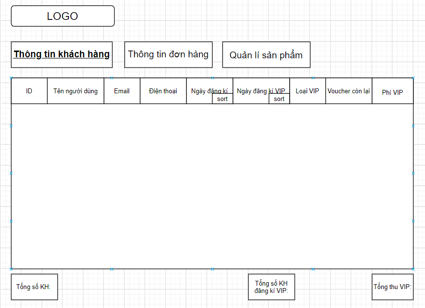

Here, you see the necessary information of customers.
  
- Orders information:

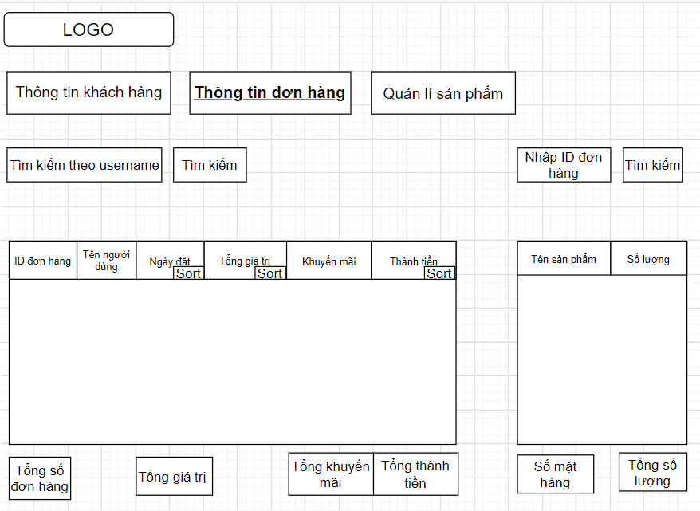

Here, you see the necessary information of orders.
  '
- Manage products:

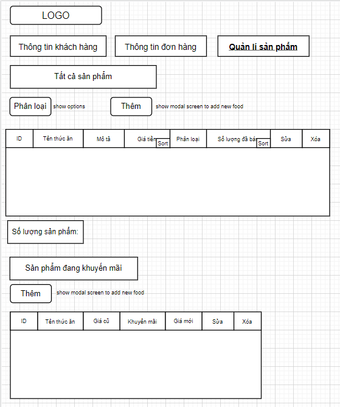

Here, you see the necessary information of products. Add, update or remove products information.
  
### *User------------------------------------------------------------------*
- We have the sitemap of the system

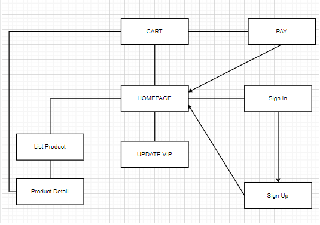
  
- Firstly, you need to login by clicking ***Đăng nhập*** on header to order products.

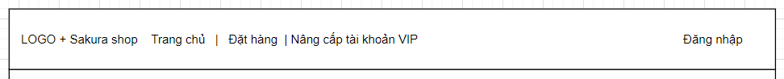
  
- The login form will appear:

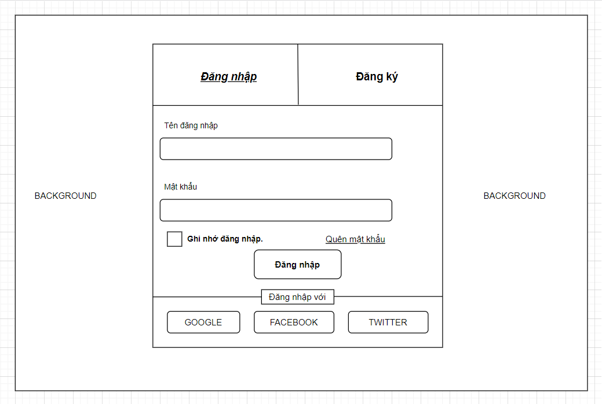
  

- If you do not have an account, please select ***Đăng ký***.

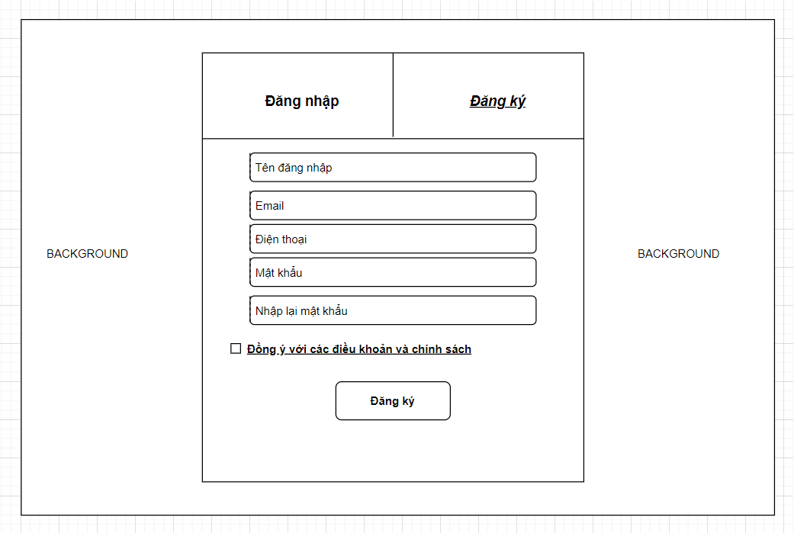
  

- After login, the system takes them to the Homepage by default. When the user is on another page in the system and clicks ***Home*** or Logo on the header, it will also return to the Homepage.

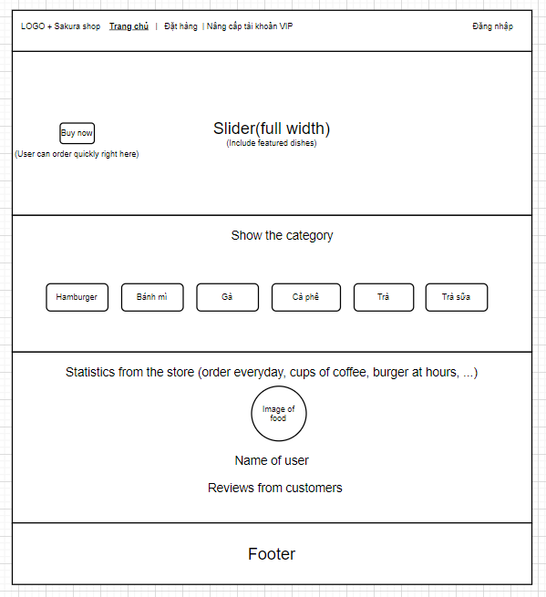
  

- When you click on ***Đặt hàng*** on the header, the web page will show:

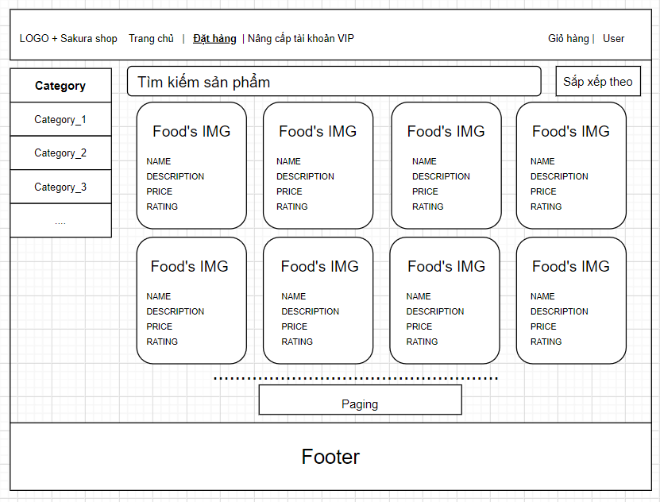

Here, you can choose the product you want to buy. You can also search by category by clicking on the left navigation, or by typing keywords in ***Tìm kiếm sản phẩm***, or by sorting products by rating, price,.... by clicking ***Sắp xếp theo***.
  
- After clicking on the product, The web page will display:

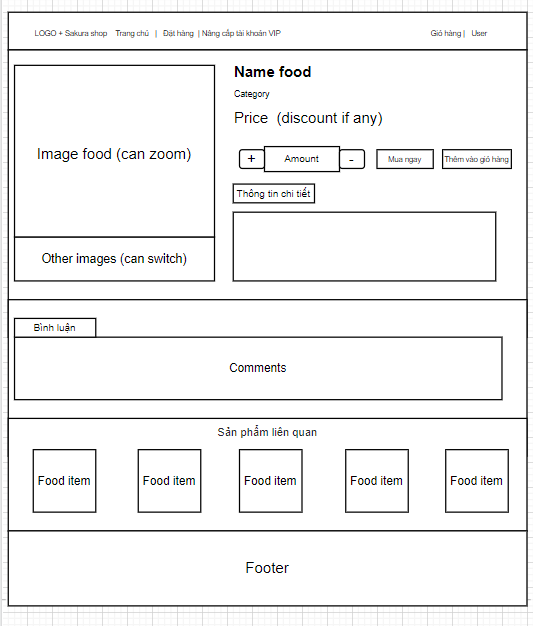
 
Here, you see more information about the product, you need to choose 1 in the list of options and quantities, you can evaluate and comment on the product. In addition, you can also refer to some related products. When you want to buy immediately, click ***Mua ngay***. Or click ***Thêm vào giỏ hàng*** when you want to buy more products.
  
- When you want to pay or see the cart. Please select ***Giỏ hàng*** on the header. The website will return:

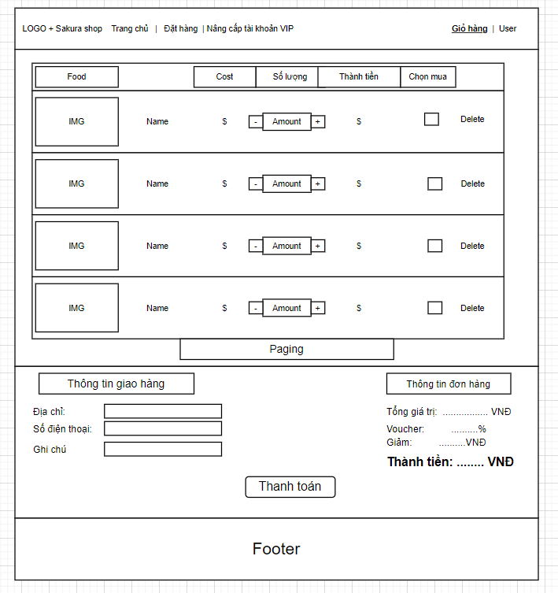

Here, you can see the products you have added, choose to buy or delete them. When you want to buy, you need to fill in the delivery information, the form of payment. 
  
- If you want more promotions from the store, click on ***Nâng cấp tài khoản VIP*** on the header. The website will return:

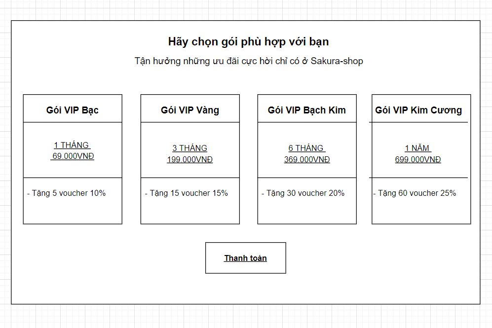

Now, you read the information and choose the right package for you. Finally enjoy great moments with Sakura-shop."# prj301-se1615-03" 
# abcxyz ahihihihihihihihihihih
